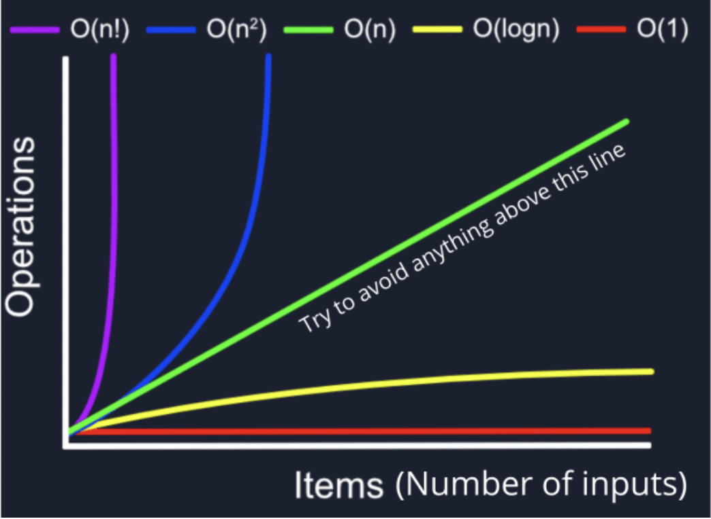

import { Card, CardGrid } from '@astrojs/starlight/components';
import { Tabs, TabItem } from '@astrojs/starlight/components';
import { LinkCard } from '@astrojs/starlight/components';
import { Icon } from '@astrojs/starlight/components';

## Intro

This documentation was built with Astro and starlight. If you would like to create your own beautuful documentation website you ca do so by visiting [Starlight website](https://starlight.astro.build/getting-started/). Prerequisites Astro [Astro](https://astro.build/). You can also find this projects source code [here.](https://starlight.astro.build/getting-started/)

## Available Components

This is a component library.

### Cards
<CardGrid>
	<Card title="Stars" icon="star">
		Sirius, Vega, Betelgeuse
	</Card>
	<Card title="Moons" icon="moon">
		Io, Europa, Ganymede
	</Card>
</CardGrid>

<Card title="Check this out">Interesting content you want to highlight.</Card>

### Link Cards
<LinkCard
	title="Customizing Starlight"
	description="Learn how to make your Starlight site your own with custom styles, fonts, and more."
	href="/guides/customization/"
/>

<CardGrid>
	<LinkCard title="Authoring Markdown" href="/guides/authoring-content/" />
	<LinkCard title="Components" href="/guides/components/" />
</CardGrid>

### Tabs
<Tabs>
	<TabItem label="Learning">
	<CardGrid stagger>
	<Card title="Sorting Algorithms" icon="pencil">
		Edit `src/content/docs/index.mdx` to see this page change.
	</Card>
	<Card title="Add new content" icon="add-document">
		Add Markdown or MDX files to `src/content/docs` to create new pages.
	</Card>
	<Card title="Searching Algorithms" icon="setting">
		Edit your `sidebar` and other config in `astro.config.mjs`.
	</Card>
	<Card title="Traversing Algorithms" icon="open-book">
		Learn more in [the Starlight Docs](https://starlight.astro.build/).
	</Card>
</CardGrid>
	</TabItem>
	<TabItem label="About Me"><CardGrid stagger>
	<Card title="Portfolio" icon="pencil">
		Edit `src/content/docs/index.mdx` to see this page change.
	</Card>
	<Card title="LinkedIn" icon="add-document">
		Add Markdown or MDX files to `src/content/docs` to create new pages.
	</Card>
	<Card title="Connect" icon="setting">
		Edit your `sidebar` and other config in `astro.config.mjs`.
	</Card>

</CardGrid></TabItem>
</Tabs>

### Code snipet
```js
// Javascript code with syntax highlighting.
var fun = function lang(l) {
  dateformat.i18n = require('./lang/' + l);
  return true;
};
```
### Icons 

<Icon name="star" color="goldenrod" size="2rem" />

## Authoring Content in Markdown

### Inline styles

Text can be **bold**, _italic_, or ~~strikethrough~~.

You can [link to another page](/big-o/bigo).

You can highlight `inline code` with backticks.

### Images




### Headings

I can link to [Cards](#Cards) lower on the same page.

